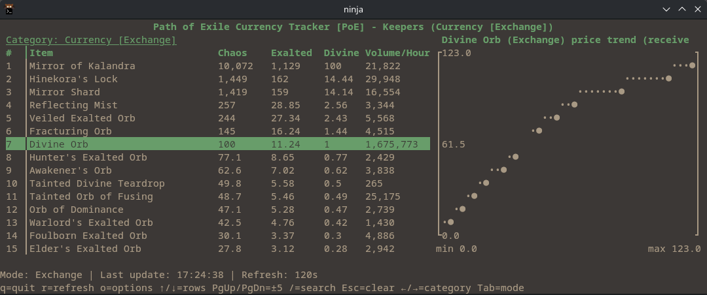
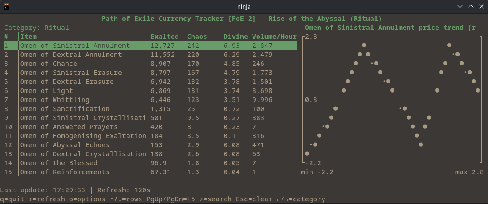
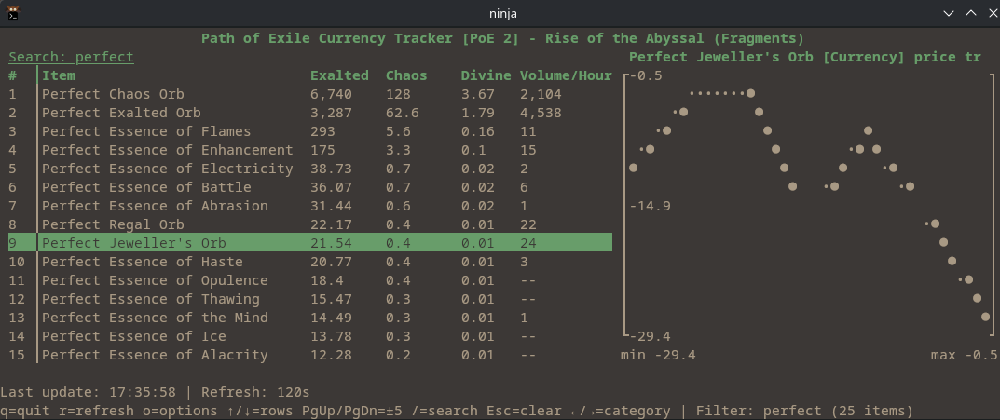

# PoE Currency Tracker

Lightweight curses terminal UI for visualising Path of Exile currency prices via the PoE Ninja API.

## Features

- Live currency overview for both Path of Exile 1 and Path of Exile 2 leagues
- Built-in category catalogue for PoE1 (Currency, Fragment, BaseType, UniqueWeapon, …) so new tabs work instantly
- Stash vs. exchange price mode toggle for PoE1 (falls back automatically if exchange data is unavailable)
- First-run interactive setup stores your preferred game and league in `tracker_config.json` (and an in-app options menu lets you tweak them later)
- Refresh interval control to remain polite to the public API
- Keyboard navigation with highlighted selection
- `/` search that doubles as an instant category jump (press <kbd>Enter</kbd> to switch to the matching overview)
- Inline ASCII sparkline showing recent trend for the selected currency
- Minimal dependencies: relies solely on the Python standard library




## Requirements

- Python 3.10 or later
- Unix-like terminal with basic colour support (tested on Arch Linux)
- Network access to `https://poe.ninja`

## Usage

```bash
python -m poe_tracker
```

- On first launch the tracker asks you to choose PoE or PoE2 and type the league name (blank answers are no longer accepted). The selections, along with the active category and price mode, are stored in `tracker_config.json` and reused on subsequent runs. Press `o` at any time to revisit those options in the TUI.
- Remove `tracker_config.json` if you want to rerun the initial prompts from scratch.

Arguments:

- `--league`: override the saved league for this run (`Standard` `Keepers` `Rise of the Abyssal`)
- `--category`: choose the initial PoE Ninja overview category (`Currency`, `Fragment`, `UniqueWeapon`, …)
- `--game`: override the saved game context (`poe` or `poe2`)
- `--ninja-cookie`: optional PoE.Ninja session cookie (or set `POE_NINJA_COOKIE`) for authenticated endpoints
- `--limit`: override the saved number of currencies to list
- `--interval`: override the refresh cadence in seconds (minimum 60s)

## Key Bindings

- `↑` / `j`: move selection up
- `↓` / `k`: move selection down
- `PgUp` / `PgDn`: jump several rows
- `←` / `→`: cycle categories
- `Tab`: toggle between *Stash* and *Exchange* pricing (PoE1 only; automatically falls back to stash when exchange data is unavailable)
- `o`: open the Options menu (change game, league, refresh interval, and item limit)
- `r`: force refresh
- `q`: quit
- `/`: (fuzzy)search entries (press <kbd>Enter</kbd> on a query such as `currency` or `basetype` to jump directly to that category)
- `Esc`: clear search
## Notes

- The PoE Ninja API enforces rate limits; the tool defaults to a 120 second refresh to stay within limits.
- When the API is unreachable, the status bar reports the failure and the UI continues to retry on the configured cadence.
- Exchange endpoints for very new leagues can return `404`. The tracker will show an info message and stick to stash data until exchange prices become available.
- The CLI flags still work as overrides, but all persistent settings (game, league, category, limit, interval, price mode) live in `tracker_config.json` (git-ignored by default) and are now scoped per game so searches stay within your active client.
